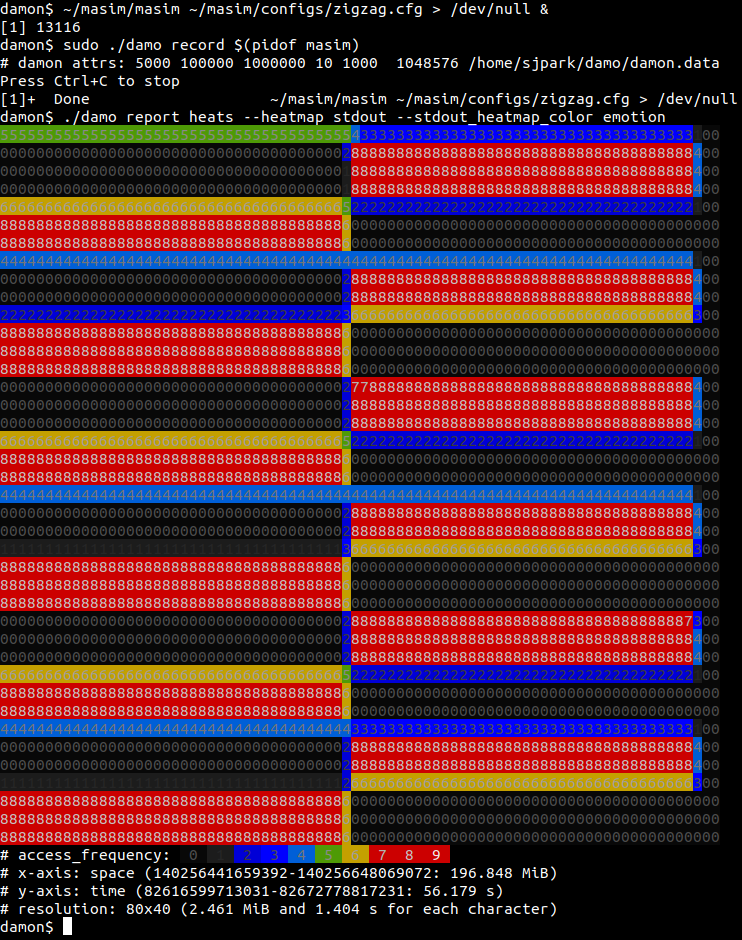

DAMO: Data Access Monitoring Operator
=====================================

`damo` is a user space tool for [DAMON](https://damonitor.github.io).  Using
this, you can monitor the data access patterns of your system or workloads and
make data access-aware memory management optimizations.

Demo Video
==========

Please click the below thumbnail to show the short demo video.

Getting Started
===============

Follow below instructions and commands to monitor and visualize the access
pattern of your workload.

    $ # ensure your kernel is built with CONFIG_DAMON_*=y
    $ sudo pip3 install damo
    $ sudo damo record $(pidof <your workload>)
    $ damo report heats --heatmap stdout --stdout_heatmap_color emotion

The last command will show the access pattern of your workload, like below:

FAQs
====

How can I install a kernel that is built with `CONFIG_DAMON_*=y`?
-----------------------------------------------------------------

Please refer to 'Install'
[section](https://sjp38.github.io/post/damon/#install) of the project webpage.

Where can I get more detailed usage?
------------------------------------

The below sections provide quick introductions for `damo`'s major features.
For more detailed usage, please refer to [USAGE.md](USAGE.md) file.

What does the version number mean?
----------------------------------

Nothing at all but indicate which version is more fresh.  A higher version
number means it is more recently released.

Will `pip3 install damo` install the latest version of `damo`?
--------------------------------------------------------------

It will install the latest _stable_ version of `damo`.  If you want, you can
also install less stable but more fresh `damo` from source code.  For that,
fetch the `next` branch of the source tree and use `damo` executable file in
the tree.

    $ git clone https://github.com/awslabs/damo -b next

How can I participate in the development of `damo`?
---------------------------------------------------

Please refer to
[CONTRIBUTING](https://github.com/awslabs/damo/blob/next/CONTRIBUTING) file.

Why some subcommands are not documented on [USAGE.md](USAGE.md) file?
---------------------------------------------------------------------

Only sufficiently stabilized features are documented there.  In other words,
any feature that not documented on [USAGE.md](USAGE.md) are in experimental
stage.  Such experimental features could be deprecated and removed without any
notice and grace priods.  The documented features could also be deprecated, but
those will provide some notification and grace periods.

Recording Data Access Patterns
==============================

Below commands record memory access patterns of a program and save the
monitoring results in `damon.data` file.

    $ git clone https://github.com/sjp38/masim
    $ cd masim; make; ./masim ./configs/zigzag.cfg &
    $ sudo damo record -o damon.data $(pidof masim)

The first two lines of the commands get an artificial memory access generator
program and run it in the background.  It will repeatedly access two 100
MiB-sized memory regions one by one.  You can substitute this with your real
workload.  The last line asks ``damo`` to record the access pattern in
``damon.data`` file.

Visualizing Recorded Patterns
=============================

Below three commands visualize the recorded access patterns into three
image files.

    $ damo report heats --heatmap access_pattern_heatmap.png
    $ damo report wss --range 0 101 1 --plot wss_dist.png
    $ damo report wss --range 0 101 1 --sortby time --plot wss_chron_change.png

- ``access_pattern_heatmap.png`` will show the data access pattern in a
  heatmap, which shows when (x-axis) what memory region (y-axis) is how
  frequently accessed (color).
- ``wss_dist.png`` will show the distribution of the working set size.
- ``wss_chron_change.png`` will show how the working set size has
  chronologically changed.

You can show the images on a web page [1].  Those made with other realistic
workloads are also available [2,3,4].

[1] https://damonitor.github.io/doc/html/latest/admin-guide/mm/damon/start.html#visualizing-recorded-patterns  
[2] https://damonitor.github.io/test/result/visual/latest/rec.heatmap.1.png.html  
[3] https://damonitor.github.io/test/result/visual/latest/rec.wss_sz.png.html  
[4] https://damonitor.github.io/test/result/visual/latest/rec.wss_time.png.html

Data Access Pattern Aware Memory Management
===========================================

Below three commands make every memory region of size >=4K that hasn't accessed
for >=60 seconds in your workload to be swapped out.  By doing this, you can
make your workload more memory efficient with only a modest performance
overhead.

    $ sudo damo schemes --damos_access_rate 0 0 --damos_sz_region 4K max \
                        --damos_age 60s max --damos_action pageout \
                        <pid of your workload>

Deprecated Features
===================

Below are features that deprecated, or will be deprecated.  If you depend on
any of those, please report your usecase to the community via github issue,
sj@kernel.org, damon@lists.linux.dev, and/or linux-mm@kvack.org.

--rbuf option of `damo record`
------------------------------

Deprecated.

Early versions of DAMON supported in-kernel direct monitoring results record
file generation.  To control the overhead of it, DAMO allowed user to specify
the size of buffer for the work.  The feature has not merged into the mainline,
and discarded.  Hence the option was available for only few kernels that ported
the feature.  For most of kernels, tracepoint based record file generation is
being used, and the overhead of the approach is subtle.  Hence, the option has
deprecated.

DAMOS singline format
---------------------

Deprecated.  Use `--damos_*` command line options or json format.

One-line scheme specification format like below was initially supported.
Because it is not flexible for extension of features, it has deprecated now.
You may use `--damos_*` command line options or json format instead.  You may
use `damo translate_damos` to convert your old single line DAMOS schemes
specification to the new json format.

`Python2 support
----------------

Deprecated.  Use Python3.

For some old distros, DAMO was initially supported Python2.  Because Python2 is
really old, the support has deprecated.  Please use Python3 or newer.

DAMON record binary format
--------------------------

Will be deprecated by 2023 Q3.

At the beginning, DAMO used its special binary format, namely `record`.  It is
designed for lightweight saving of the monitoring results.  It is difficult to
read, and not that efficient compared to fancy compression techniques.  `json`
based monitoring results can be easier to read, and more efficient when
compression technique is used.  Hence, the format will be deprecated.  You may
use `damo convert_record_format` to convert your old record binary format
monitoring results files to the new format.
